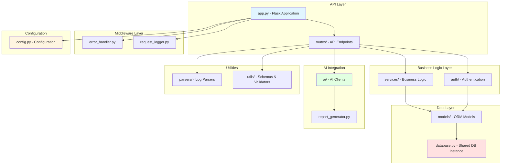
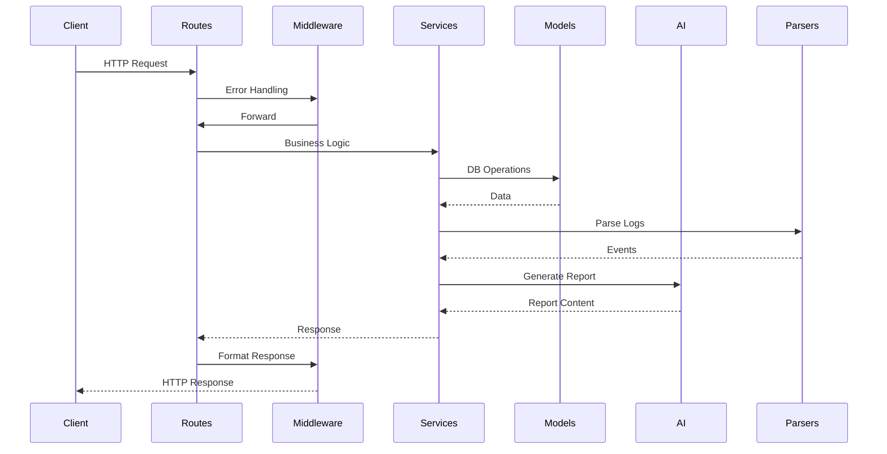

# Backend Architecture Diagram

> **Merged backend (2026-07-30).** `backend/` is now the single Flask
> application. The former standalone `incidentiq/` server was retired: its
> Azure log parser moved to `parsers/azure_parser.py` and its TCS gateway
> client to `ai/genailab_client.py`. `incidentiq/` keeps only the React
> frontend, which calls this API at `http://localhost:5000/api`.
>
> **Auth:** incident/report/analytics routes use `@jwt_optional` — they work
> with or without a token; unauthenticated calls are attributed to a seeded
> `demo` user. Swap back to `@jwt_required()` once the frontend has a login.
>
> **Hierarchy:** one log file becomes one *parent* `Incident` plus one *child*
> per `INCIDENT N` section; children inherit the parent's status and category.

## Simplified Folder Structure

```
backend/
├── app.py                 # Flask application factory & configuration
├── config.py              # Environment-based configuration
├── database.py            # Shared SQLAlchemy database instance
│
├── ai/                    # AI Integration Layer
│   ├── __init__.py
│   ├── base_client.py     # Abstract interface for AI clients
│   ├── genailab_client.py # TCS GenAI Lab gateway client (primary)
│   ├── ollama_client.py   # Ollama local LLM client
│   ├── openai_client.py   # OpenAI API client
│   └── report_generator.py # AI-powered report generation
│
├── auth/                  # Authentication & Authorization
│   ├── __init__.py
│   ├── decorators.py      # Auth decorators
│   └── jwt_handler.py     # JWT token management
│
├── middleware/            # Request/Response Middleware
│   ├── __init__.py
│   ├── error_handler.py   # Centralized error handling
│   └── request_logger.py  # Request logging
│
├── models/                # SQLAlchemy ORM Models
│   ├── __init__.py
│   ├── user.py            # User model
│   ├── incident.py        # Incident & IncidentEvent models
│   └── report.py          # Report model
│
├── parsers/               # Log File Parsers
│   ├── __init__.py
│   ├── base_parser.py     # Abstract parser interface
│   ├── azure_parser.py    # Azure block/hierarchical parser (parent+children)
│   ├── csv_parser.py      # CSV log parser
│   ├── json_parser.py     # JSON log parser
│   ├── txt_parser.py      # Plain text log parser
│   ├── syslog_parser.py   # Syslog format parser
│   └── parser_factory.py  # Parser factory pattern
│
├── seed_logs.py           # Seed the DB from logs/ and sample_logs/
│
├── routes/                # API Endpoints (Flask-RESTX)
│   ├── __init__.py
│   ├── auth_routes.py     # Authentication endpoints
│   ├── incident_routes.py # Incident CRUD operations
│   ├── report_routes.py   # Report generation & management
│   └── analytics_routes.py # Analytics endpoints
│
├── services/              # Business Logic Layer
│   ├── __init__.py
│   └── incident_service.py # Log parsing -> Incident/IncidentEvent persistence
│
├── utils/                 # Utilities & Helpers
│   ├── __init__.py
│   ├── schemas.py         # Marshmallow validation schemas
│   └── validators.py      # Custom validators
│
└── tests/                 # Unit Tests
    ├── __init__.py
    ├── conftest.py        # Pytest configuration
    ├── test_models.py     # Model tests
    └── test_parsers.py    # Parser tests
```

## Architecture Diagram (Mermaid)



## Data Flow



## Key Simplifications Made

1. **Single Database Instance**: Consolidated multiple `db` instances across models into `database.py`
2. **Removed Empty Directories**: Deleted unused analytics/, migrations/, reports/, static/, templates/, uploads/
3. **Registered Middleware**: Integrated error_handler into app.py
4. **AI Client Interface**: Added BaseAIClient abstract class for consistent AI client implementation
5. **Cleaner Structure**: Organized imports and reduced code duplication

## Technology Stack

- **Framework**: Flask + Flask-RESTX
- **Database**: SQLAlchemy ORM
- **Authentication**: JWT (Flask-JWT-Extended)
- **AI**: TCS GenAI Lab gateway (primary, cloud) / OpenAI (opt-in) / Ollama (local fallback)
- **Validation**: Marshmallow
- **Testing**: Pytest
